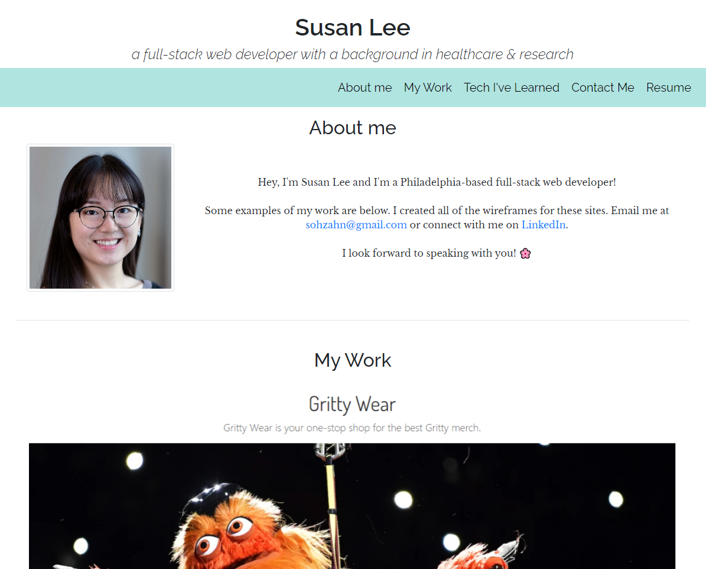

# Susan's Portfolio

## Description

Hey, I'm Susan Lee and I'm a Philadelphia-based full-stack web developer! 

Some examples of my work are below. I created all of the wireframes for these sites. Email me at sohzahn@gmail.com or connect with me on [LinkedIn](https://www.linkedin.com/in/susan-l-9074b523b/). I look forward to speaking with you! &#127800;

My portfolio site includes my past projects, resume, and contact info.

## Portfolio

Link to [Susan's Portfolio](https://s-s-lee.github.io/susan-portfolio/)

## Projects I worked on

### [Study Buddy](https://study-buddy-dream-team.herokuapp.com/)

Study Buddy is a web app to help students and other learners keep track of their notes by using notecards and card decks. 

### [Gritty Wear](https://grittywear.herokuapp.com/)

Gritty Wear offers the best Gritty gear for you and your loved ones without paying a premium price AND the chance to get a discount code if you beat Gritty in a game!

Mobile friendly e-commerce site that uses the Stripe API to process discount codes and to securely checkout.

### [Ars Animatio](https://github.com/RahsanLewis/ARS-Animatio/)

Created a search engine site that searches GIPHY for a GIF and a random programming joke from a Geek Jokes API.

## Technology that I frequent

React, Node, and JavaScript are favorites. I'm also familiar with Bootstrap, SQL, jQuery, PWAs, NoSQL, MongoDB, GraphQL, Stripe, and Python.

## Licensing

The code in this project is licensed under the [MIT License](https://github.com/s-s-lee/susan-portfolio/blob/main/LICENSE).

## Contact Info

For questions, contact Susan at sohzahn@gmail.com