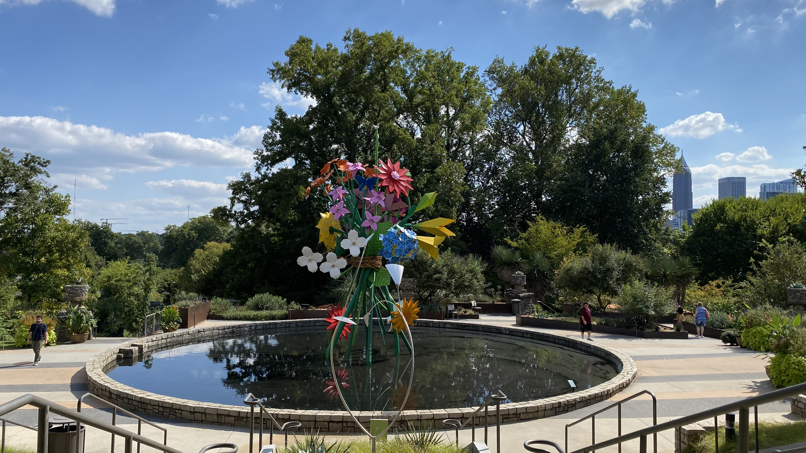

# Susan's Portfolio

## Description

For potential employers to review Susan Lee's portfolio. This website includes my past projects, resume, and contact info.

## Portfolio

Link to [Susan's Portfolio](https://s-s-lee.github.io/susan-portfolio/)

## Projects I worked on

### [Ars Animatio](https://github.com/RahsanLewis/ARS-Animatio/)

Created a search engine site that searches GIPHY for a GIF and a random programming joke from a Geek Jokes API.

### [Horiseon](https://s-s-lee.github.io/code-refactor/)

Updated a marketing agency's website to meet accessibility standards.

### [Origami Sculpture](https://s-s-lee.github.io/code-refactor/)

I also visited the Atlanta Botanical Gardens and felt refreshed by nature. They had beautiful origami sculptures all throughout the garden.

## Technology that I want to specialize in

So far, I am hoping to specialize in React, Node, and JavaScript!

## Licensing

The code in this project is licensed under the [MIT License](https://github.com/s-s-lee/susan-portfolio/blob/main/LICENSE).